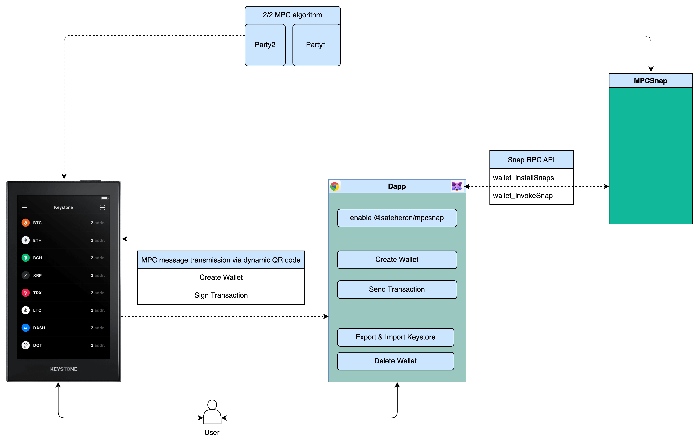

# MPCSnap

MPCSnap provides a 2/2 MPC wallet between MetaMask Snap and Keystone to manage EVM assets.

## Architecture

## Use MPCSnap

- We have published MPCSnap on the npm repository, please follow the readme [here](./packages/snap/README.md)
- We forked the Keystone repository and added MPC-related features, as detailed [here](https://github.com/Safeheron/Keystone-cold-app)

## Test MPCSnap

### Metamask Flask

First, install Metamask Flask to use MPCSnap.

- checkout [Metamask Flask page](https://metamask.io/flask/)
- Install Metamask Flask on your chrome

### Keystone

In the example we provided, the Keystone hardware wallet is one of the two parties of the MPC algorithm,
We forked the source code for Keystone and developed the MPC wallet section, checkout the [repository](https://github.com/Safeheron/Keystone-cold-app).

### Demo video (Upcoming)

### Live demo

Test MPCSnap in this [example](https://mpcsnap.safeheron.com).

### Run MPCSnap demo locally

- `yarn install`
- `yarn run prestart`
- `yarn start`

## Disclaimer

The MPCSnap code implemented this time is only used as POC for MetaMask Snaps.
We shall not be liable for the consequences of any act for commercial purposes.
